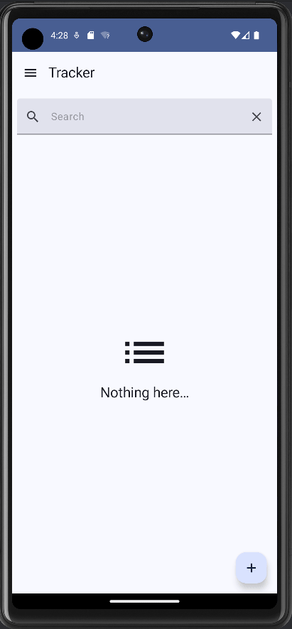
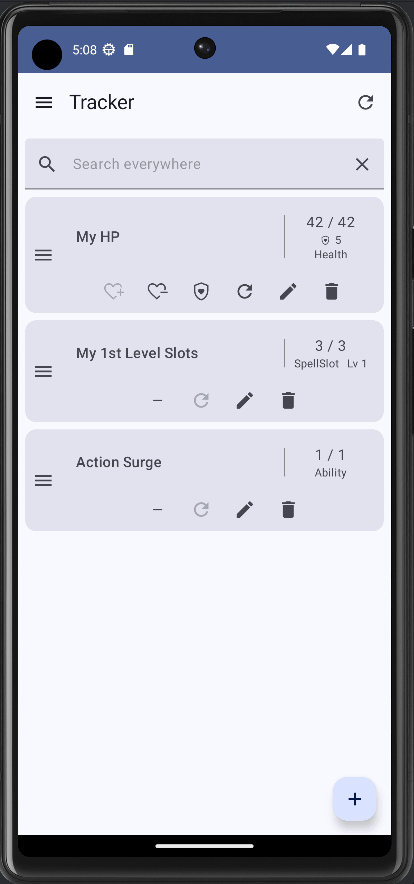

# generictabletoprpg

This is an app that helps you quickly access your dungeonmastersvault data via your Android device.
It can also help you track various things (see below).

:new: Now also available on Windows, Linux and macOS!

Or download the latest APK from
the [Releases Section](https://github.com/feko006/generictabletoprpg/releases/latest).

Or, register as a closed tester
via [Web](https://play.google.com/apps/testing/com.feko.generictabletoprpg)
or [Android](https://play.google.com/store/apps/details?id=com.feko.generictabletoprpg).

Note: Closed testing is a prerequisite to making the application public on the Google Play Store. If
eventually this app reaches a certain amount of users, this section will be updated with the public
link to the Google Play Store!

Also, feedback is very welcome and appreciated!

## Table of Contents

- [Features](#features)
    - [DMV Import](#dmv-import)
    - [Tracker](#tracker)
        - [Supported Types](#supported-types)
        - [Long Rest](#long-rest)
    - [Encounters](#encounters)
    - [Own Your Data](#own-your-data)
- [Disclaimers](#disclaimers)
- [License](#license)

## Features

### DMV Import

Import your DMV (dungeonmastersvault.com) content as a json file and make it accessible on your
mobile device.
Your actions, armor, conditions, diseases, feats, spells and weapons will be imported in the app.
Use the Index to search everywhere. You can also search everywhere from the tracker.

    
See it in action...

	

### Tracker

Track various things for your character, world, NPC, monster or whatever you can creatively think of
with a generic tracker.

#### Supported Types

- Arbitrary percentage
- HP + temporary HP too!
- Abilities
- Spell slots
- Arbitrary number, e.g. for gold, arrows...
- Known & prepared spells + more
- Text e.g. for notes, items...
- Hit dice
- Stats :new:

More types will be supported in the future.

#### Long Rest

Refreshes some of the tracked things like HP, spell slots...

    
See it in action...

	

### Encounters

Avoid a part of the tediousness of combat with the encounter tracker. Track initiative, lair
actions, HP, legendary actions and more! Mark entries as favorites and reset the encounter for
starting a new one.

    <dummary>See it in action...</dummary>
    

### Own Your Data

Export your data, store it wherever you want, share it to your friends, or import it in case you
install the app on a new device.

    
See it in action...

	

## Disclaimers

- This app is not affiliated with *WotC* or *The Dungeon Master's Vault*.

## License

GPL-3.0 - GNU General Public License v3.0

See [LICENSE.md](LICENSE.md) file.
